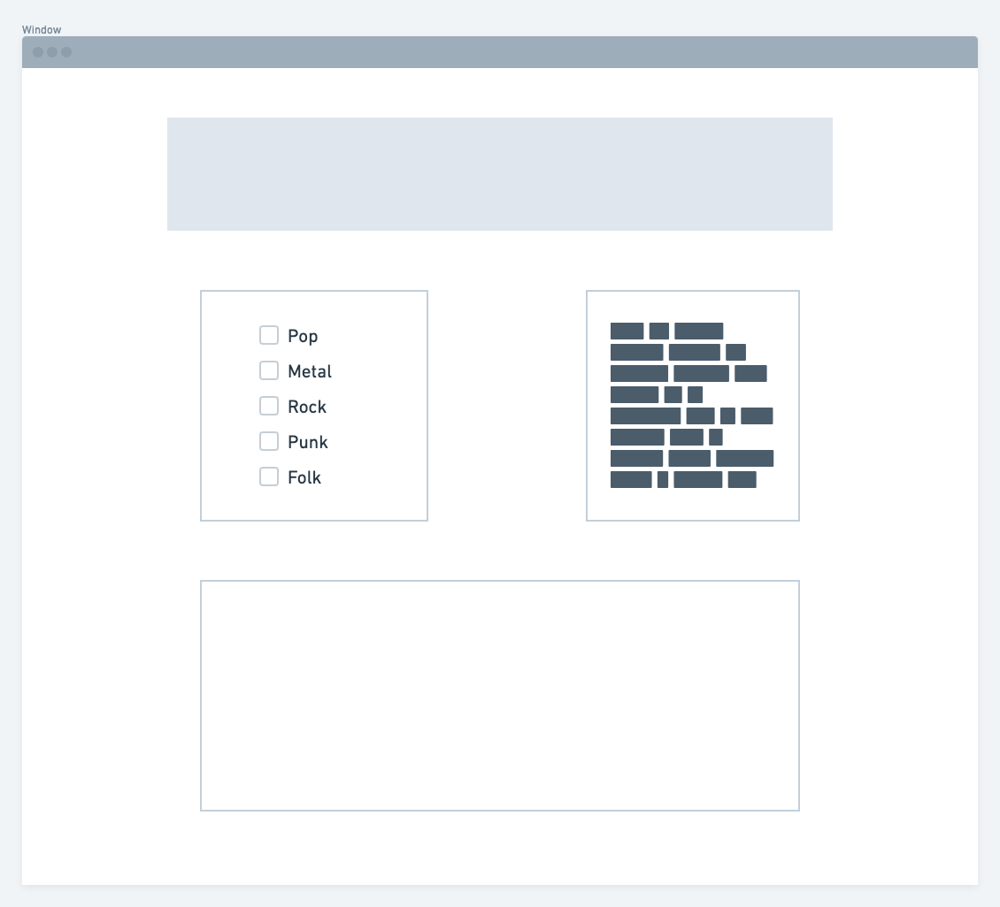

# project_01
This Project is a playlist generator.
The user is able to chose a genre, send a request to the music api's https://musicbrainz.org/doc/MusicBrainz_API and https://affiliate.itunes.apple.com/resources/documentation/itunes-store-web-service-search-api/

this will gererate a random playlist of 10 songs that all have the gene chosen by the user.

this is the wire frame 

The main functions will:

will be triggered by an event listner connected to buttons with the id of various genres.

using the button id, we can specify which genre we want songs from, and get the data from the api using a fetch method. 

this data will get sent to a function that will push 5 songs to an empty playlist array.

the array will be displayed using html
~~~~~~~~~~~~~~~~~~~~~~~~~~~~~~~~~~~~~~~~
the user will be able to  lick on certain songs and add that song to their personal playlist.
they will be able to view thair personal playlist at any time.

when the user chooses a genre, the css will change color pallettes